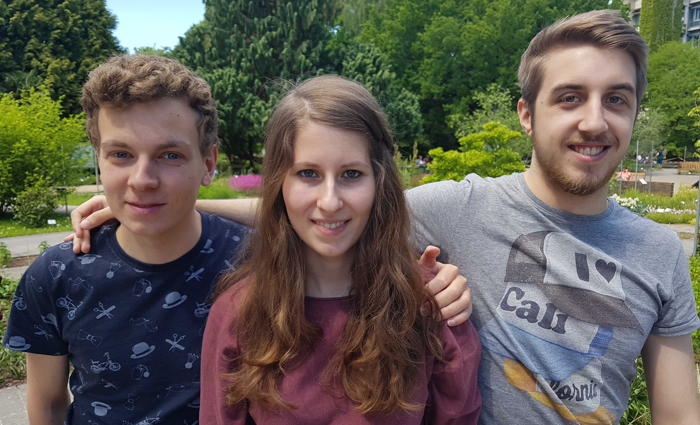

# Steckbrief zur Spielekonsole B
## Fortgeschrittenenpraktikum im Sommersemester 2017

Supervisor
: Prof.\ Dr.\ Katja Mombaur

Betreuer
: Simon Kohlhepp

### Das Team
- Daniela Kilian, Angewandte Informatik, 6.\ Semester
- Stefan Müller, Angewandte Informatik, 6.\ Semester
- Robert Schütz, Mathematik, 6.\ Semester & Angew.\ Informatik, 4.\ Semester

{width=6.5cm}

### Aufgabenstellung
Unser Ziel ist die Konzeption und Implementierung eines Spiels
für eine Spielekonsole auf Basis zweier ATmega Mikrocontroller.
Dieses soll über eine ansprechende Grafik und Soundeffekte verfügen.

Die Schwierigkeiten hierbei sind der geringe verfügbare Speicherplatz
und die limitierte Geschwindigkeit des Displays.

### Milestones
    Zu erledigen bis Milestone
-------------------- ---------------------
11.\ Juni            Einarbeitung in die ATmega-Programmierung
                     Auswahl des Spiels
29.\ Juli            Einfache Umsetzung der Spielidee
                     Kontinuierliche Optimierung der Implementation
31.\ August          Erweiteung des Spiels durch mehrere Level, Highscores, etc.
15.\ Spetember       Gestaltung der Soundeffekte
zur Präsentation     Ausarbeitung von Vortrag und Website
