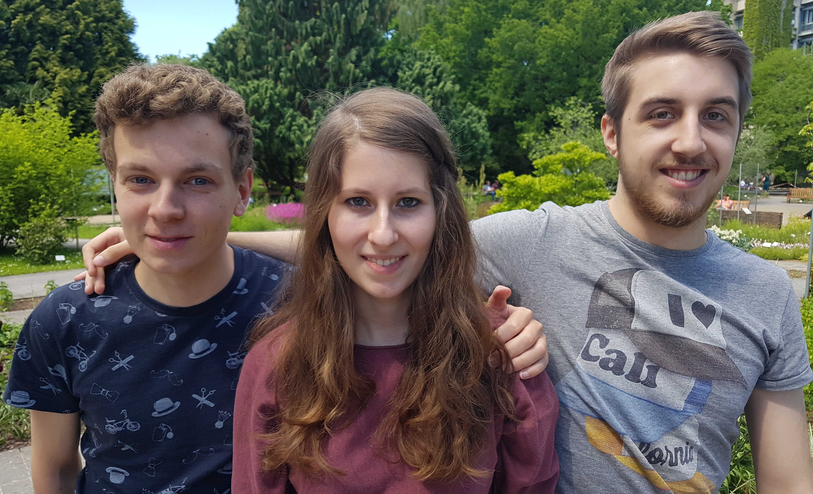

---
css:
    - css/main.css

title: Metroid
---

# The Task

# Hardware


# About Us
{width=100%}

* Daniela Kilian
    - BSc Applied Computer Science
    - 6th semester
* Stefan Müller
    - BSc Applied Computer Science
    - 6th semester
* Robert Schütz
    - BSc Mathematics
    - 6th semester

# Movement
To make things simpler, we decided to move only whole pages in the vertical direction.
Additionally, different monsters etc. are never at the same position,
or if they are then this means that e.g. a projectile has hit a monster and both can be undrawn.
This allows us to only consider the object in motion when redrawing it at a new position.

## Implementation
We use a single C `struct` for monsters, projectiles and the protagonist.
This enables us to reuse the functions responsible for movement for all of them,
which saves us quite some flash space.

```{.c include=../master/character.h startline=13 endline=24}
```

First, there are the functions `moveleft`, `moveright`, `moveup` and `movedown`.
These take care of

- checking if there is an obstace, e.g. a platform, in the respective direction,
- redrawing the character at its new position and
- clearing the pixels that are left over from the old position.

Then, there is also a function `move` which automatically decides in which direction to move.
For example, a monster with `movement=FOLLOW_PROTAGONIST` will automatically move towards the protagonist
whenever this function is called with that very monster as argument.
