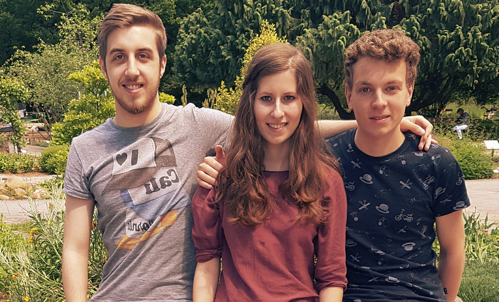

# About Us
{width=100%}

* Daniela Kilian
    - BSc Applied Computer Science
    - 6th semester
* Stefan Müller
    - BSc Applied Computer Science
    - 6th semester
* Robert Schütz
    - BSc Mathematics
    - 6th semester

We were supervised by Simon Kohlhepp.

# The Task
Our task was to design and implement a game for a console resembling the Nintendo Gameboy. 
The console should also have a sound output for music and sound effects.


## Hardware
{width=50%}

The console features two microcontrollers:

* [Atmega328](https://en.wikipedia.org/wiki/ATmega328) with
    - 32 kB flash
    - 2 kB SRAM
    - 1 kB EEPROM
* Atmega168 with
    - 16 kB flash
    - 1 kB SRAM
    - 512 B EEPROM

where the former is responsible for the game logic and controlling the display
and the latter is used solely as a sound controller.

Furthermore, it features an
[EA DOGXL160L-7](http://www.lcd-module.com/eng/pdf/grafik/dogxl160-7e.pdf).
This LC display has a resolution of 160×104 pixels,
but 4 vertically adjacent pixels are grouped together in so-called pages
and can only be written as a whole.
Therefore, when writing to the display,
the x coordinate must be below 160 and the y coordinate below 25.

Last but not least, the 8 buttons known from the Gameboy are available:

* left, right, up, down
* A, B
* pause, select

# The Game
{width=100%}

We based our game on the Metroid Series, especially on Metroid Fusion which is an action-adventure jump'n'run game.


So what is there to do in our game?


{width=50%}


There are no less than 8 monster types in our game. The protagonist faces at least one of them in each room and can kill them with his rockets or one of his bombs.


{width=50%}

Additionally there are different obstacles like water or spikes in the different levels. 

{width=50%}

Before every fifth level, there is a so called recharge room, where the protagonist can refill his energy and ammunition.

{width=50%}


After the recharge room there will be a boss encounter in which one of the 4 bosses appear.
All the bosses have different moves and abilities, so none is like the other.

{width=50%}


After successfully defeating a boss the protagonist obstains a Power-Up.


The amount of monsters which can appear in one room will increase by one after each successful boss fight.


# Drawing
<!-- TODO python script etc -->

## Drawing a sprite
<!-- TODO drawsprite() & drawsprite_px() -->

# Level Setup
Every level consists of a number of rooms, whereby the number of rooms is a random number between one and five. 
Furthermore the monster(s), the positions of the platforms and water are chosen randomly for every new room and the floor and ceiling sprite is chosen randomly for every new level. 

To make sure that a level you have already been to looks the same as before, we choose the seed of the random number generator depending on the level and on the room the protagonist is in. There are three variables for the three different heights on which the platforms can appear and one variable for the water:


```{.c}
    srandom(level_seed + level_pos);
    platforms_13 = random();
    platforms_19 = random();
    platforms_24 = random();
    nofloor = random();
``` 

## Depth-first Search
Since the position of the platforms and the water is chosen randomly,
it is possible that the protagonist is not able to simply walk from left to right,
Nevertheless, we have to ensure that he can reach the door.
Therefore, we implemented an algorithm based on
[depth-first search](https://en.wikipedia.org/wiki/Depth-first_search)
that tries to find a path from left to right and also considers jumping on platforms.
Below, we will explain the idea behind this algorithm using an exemplary level.

{width=50%}

{width=50%}

{width=50%}

{width=50%}

{width=50%}

{width=50%}

{width=50%}

If there is no path, we set the `nofloor` variale to a new random value
and try again to find a path to the door.

# Movement
To make things simpler, we decided to move only whole pages in the vertical direction.
Additionally, different monsters etc. are never at the same position,
or if they are then this means that e.g. a projectile has hit a monster and both can be undrawn.
This allows us to only consider the object in motion when redrawing it at a new position.

## Implementation
We use a single C `struct` for monsters, projectiles and the protagonist.
This enables us to reuse the functions responsible for movement for all of them,
which saves us quite some flash space.

```{.c include=../master/character.h startline=11 endline=30}
```

First, there are the functions `moveleft`, `moveright`, `moveup` and `movedown`.
These take care of

- checking if there is an obstace, e.g. a platform, in the respective direction,
- redrawing the character at its new position and
- clearing the pixels that are left over from the old position.

Then, there is also a function `move` which automatically decides in which direction to move.
For example, a monster with `movement==FOLLOW_PROTAGONIST` will automatically move towards the protagonist
whenever this function is called with that very monster as argument.

# Sound
We have different background tunes playing during the levels.
Additionally, there is a characteristic music for each boss you can encounter.
The code supports playing up to three tones at the same time.
Additionally, sound effects are played ontop the background music
when a rocket is shot and when a bomb explodes.

Since synthesizing sound is a time-expensive task,
this is done on a dedicated microcontroller (Atmega168)
to which the speaker is connected through pin B1.

To generate a sound wave,
one can use [pulse-width modulation](https://en.wikipedia.org/wiki/Pulse-width_modulation).
If the frequency of the PWM signal is too high for for the human ear to perceive,
then the displacement of a sound wave can be determined by the pulse width:


But instead of a sinusodial wave, we use [saw waves](https://en.wikipedia.org/wiki/Sawtooth_wave).
To generate this PWM signal, we use Timer1 of the Atmega168 in 8-bit Fast PWM mode.
The `TOP` value of $255$ is reached with a frequency of $62500\,\mathrm{Hz}$.
By setting the register `OCR1A`, we can determine the pulse width,
because B1 is set to high at $0$ and set to low when reaching `OCR1A`.

`OCR1A` is set in the interrupt of Timer2,
which is called with a frequency of $15625\,\mathrm{Hz}$.
To e.g. generate a tone with $440\,\mathrm{Hz}$,
we simply need to reach the maximum pulse width ($255$) with a frequency of $440\,\mathrm{Hz}$.
To do this, the pulse width can simply be incremented by

$$ \frac{255}{15625\,\mathrm{Hz} / 440\,\mathrm{Hz}} \approx 7.18 $$

each time the interrupt is called.
Because of integer overflow,
it will automatically be set to $0$ again after reaching $255$
if we use a `uint8_t`{.c}.
But since we cannot represent non-integer values like $7.18$,
we use `uint16_t`{.c}s and increment the pulse width by

$$ \lfloor 7.18 \cdot 256 \rfloor = \lfloor 1838.08 \rfloor = 1838 $$

which is obviously a lot more accurate.
Additionally, Timer2 is used to keep track of the time.

To make easier to write our own music for the console and use existing tunes,
we wrote a Python script that converts MIDI files
into C arrays that are stored in the `PROGMEM`.
We use the [mido](https://mido.readthedocs.io/en/latest/) library to read the files.
The entries of these arrays contain information about

- the track (as explained above, there are three channels for the music),
- the increment corresponding to the tone that should be played
  (an increment of $0$ means that no tone should be playing on this track)
  and
- the delay until the next entry in the array should be read.

For example, an array could look like this:
```{.c}
const Event boss4[] PROGMEM = {
    { { .track = 0, .increment = 615, .delay = 0 } },
    { { .track = 1, .increment = 307, .delay = 0 } },
    { { .track = 2, .increment = 2463, .delay = 2812 } },
    { { .track = 2, .increment = 1231, .delay = 2812 } },
    { { .track = 0, .increment = 1231, .delay = 0 } },
    ...,
    STOP
};
```

# Statistics
Our git repository has about 450 commits.

Regarding the lines of code,
excluding those generated by scripts,
we have the `master` folder:
```{.sh}
$ find master/ -type f -not -name "sprites.*" | xargs sloccount
ansic:         3279 (98.44%)
python:          52 (1.56%)
```
and the `slave` folder:
```{.sh}
$ find slave/ -type f -not -name "music.*" -not -name "fx.*" | xargs sloccount
ansic:          327 (75.00%)
python:         109 (25.00%)
```

# Download
You can download the source code of this project from
[GitHub](https://github.com/dotlambda/metro-hd).
If you are a [Nix](https://nixos.org/nix/) user,
you can use the provided `shell.nix` to get an environment with
every package you need to compile and upload the code to the console.

Also have a look at the [slides](static/slides.pdf)
of the presentation we gave at the end of the practical.
