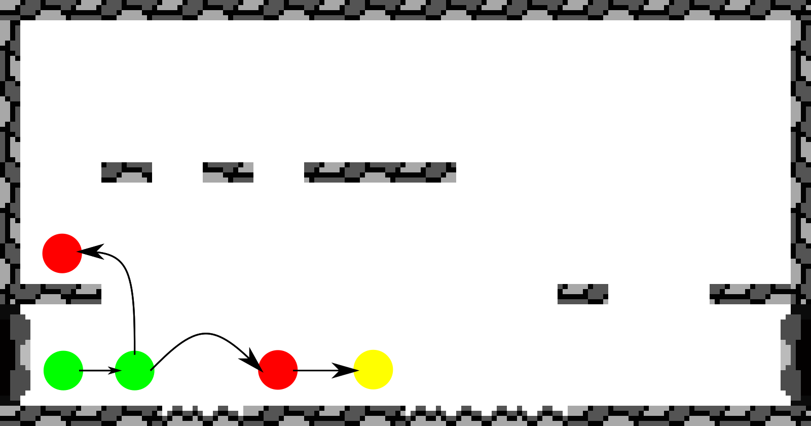

---
css:
    - css/main.css

title: Metroid
---

# The Task

# Hardware
The console features two microcontrollers:

* [Atmega328](https://en.wikipedia.org/wiki/ATmega328) with
    - 32 kB flash
    - 2 kB SRAM
    - 1 kB EEPROM
* Atmega168 with
    - 16 kB flash
    - 1 kB SRAM
    - 512 B EEPROM

where the former is responsible for the game logic and controlling the display
and the latter is used solely as a sound controller.

# About Us
{width=100%}

* Daniela Kilian
    - BSc Applied Computer Science
    - 6th semester
* Stefan Müller
    - BSc Applied Computer Science
    - 6th semester
* Robert Schütz
    - BSc Mathematics
    - 6th semester

# Level Setup

## Depth-first Search
Since the position of the platforms and the water is chosen randomly,
it is possible that the protagonist is not able to simply walk from left to right,
Nevertheless, we have to ensure that he can reach the door.
Therefore, we implemented an algorithm based on depth-first search
that tries to find a path from left to right and also considers jumping on platforms.
Below, we will explain the idea behind this algorithm using an exemplary level.

{width=50%}

{width=50%}

{width=50%}

{width=50%}

{width=50%}

{width=50%}

{width=50%}

If there is no path, we set the `nofloor` variale to a new random value
and try again to find a path to the door.

# Movement
To make things simpler, we decided to move only whole pages in the vertical direction.
Additionally, different monsters etc. are never at the same position,
or if they are then this means that e.g. a projectile has hit a monster and both can be undrawn.
This allows us to only consider the object in motion when redrawing it at a new position.

## Implementation
We use a single C `struct` for monsters, projectiles and the protagonist.
This enables us to reuse the functions responsible for movement for all of them,
which saves us quite some flash space.

```{.c include=../master/character.h startline=11 endline=30}
```

First, there are the functions `moveleft`, `moveright`, `moveup` and `movedown`.
These take care of

- checking if there is an obstace, e.g. a platform, in the respective direction,
- redrawing the character at its new position and
- clearing the pixels that are left over from the old position.

Then, there is also a function `move` which automatically decides in which direction to move.
For example, a monster with `movement=FOLLOW_PROTAGONIST` will automatically move towards the protagonist
whenever this function is called with that very monster as argument.
